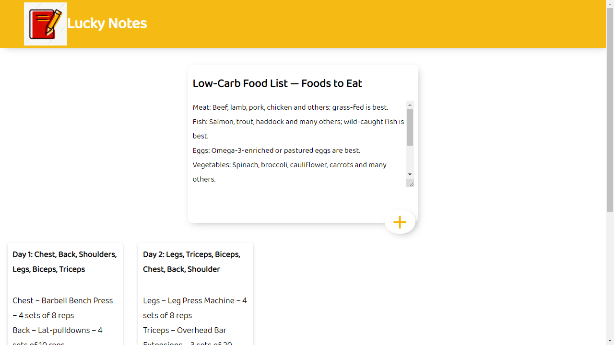

# GoogleKeepApp

[Website](https://lalithesh11.github.io/GoogleKeepApp/)

### Overview of the project:

It is a <strong>NotesApp</strong> where we can add our daily tasks or important information.

### Steps:

1. To add the notes, simply provide Title & enter the notes information and click on "+" icon.
2. To delete the notes, click on delete icon.

Technologies used are <strong>ReactJS, CSS</strong>